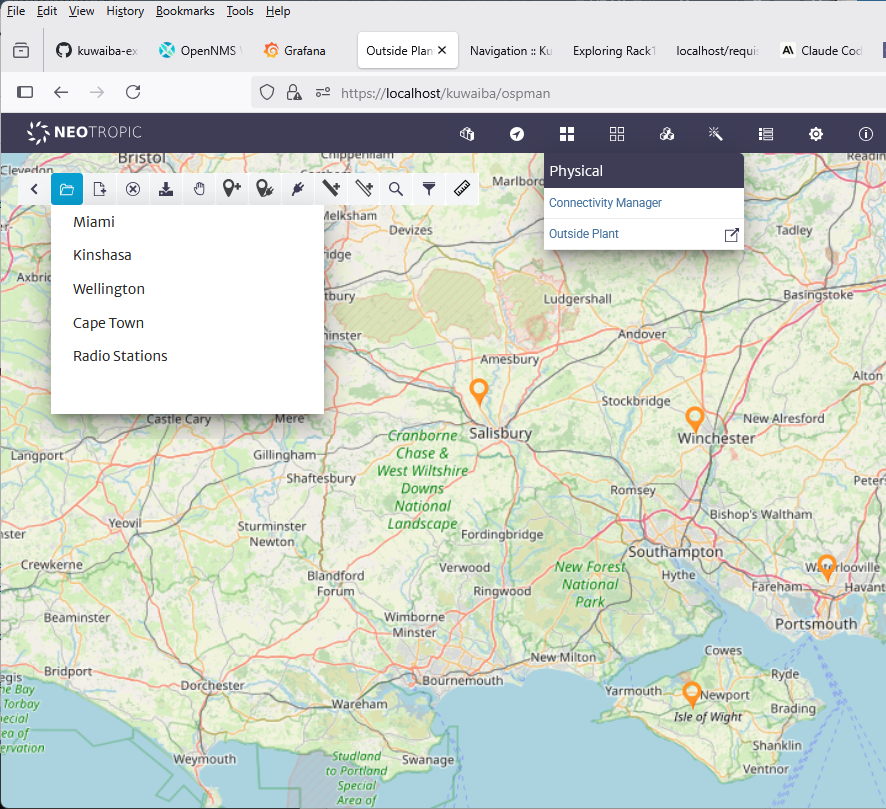

# Broadcast Radio Network Management Example

This example shows how Kuwaiba and OpenNMS can be used to model and manage a broadcast radio network.

<table>
  <tr>
    <td></td>
    <td> 
    
    </td>
  </tr>
</table>

## Contents

[docs](./docs) Case Study - Broadcast Radio Management using OpenNMS and Kuwaiba contains detailed documentation on the project.

[kuwaiba-docker-compose-radio](./kuwaiba-docker-compose-radio) contains a docker compose project for running examples.

[report-scripts](./report-scripts) Kuwaiba report scripts used in project.

[radio-mibs](./radio-mibs) Radio Manufacturer MIB files, snmpsim simulator files and OpenNMS compiled MIBs for each device. (THese are also copied into the OpenNMS horizon configuration in the docker compose project) 

