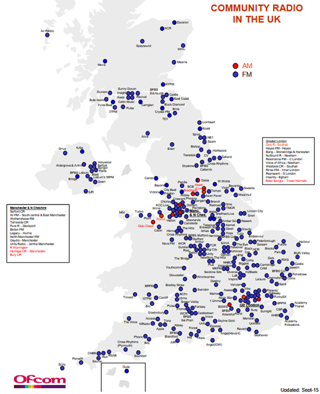
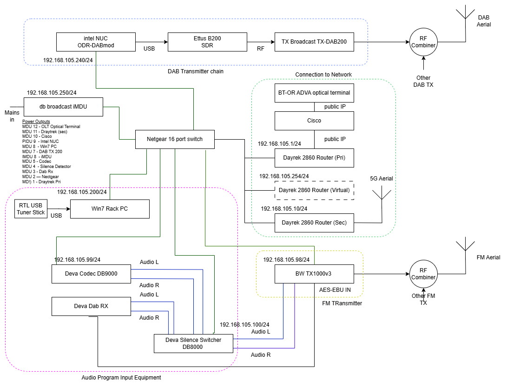
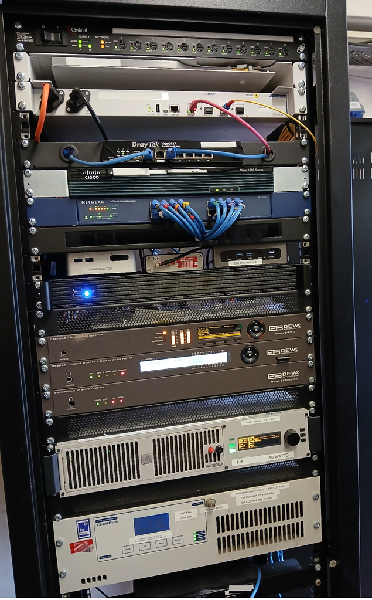

# Overview of Broadcast Radio Management with Kuwaiba and OpenNMS

[Main Menu](../README.md) | [Radio Management Case Study](./README.md)

## Introduction
The Office of Communications (OFCOM) has licenced a network of small community radio stations to operate across the UK as illustrated in map below.

[source OFCOM](https://www.ofcom.org.uk/siteassets/resources/documents/manage-your-licence/community-radio/community-map.pdf?v=331663)

Many of these small stations are operated independently by small local organisation but some larger companies operate collections of stations.
Community local radio typically operates on a very tight budget and in many cases the stations have expertise in studio equipment but not in radio frequency transmitters. 
This leads them to outsource the construction and maintenance of the radio broadcast transmitters to small independent engineering companies who specialise in provisioning low cost broadcast infrastructure provided by OEM broadcast equipment manufacturers.

The stations cannot afford to have any breaks in transmission as this can significantly affect market share, audience perception and advertising revenues. 
For this reason, most of the transmission chain is often duplicated so that in the event of a single equipment failure, the station can remain on air.

However it is also very important to be able to detect and react to faults before a problem escalates to a station outage.
Often service monitoring is done through fairly manual mechanisms including the stations listening to their own output, listeners reporting problems or simple emails being sent out by the faulty transmission equipment.
Clearly this is a bit disjointed and not entirely satisfactory. 
A cost effective monitoring system which can detect and escalate faults would be very desirable.

In this project we demonstrate how comprehensive monitoring solution could be constructed using OpenNMS and Grafana to monitor a variety of transmission stations and provide independent alerts and dashboards to each of the local radio contractors.

In addition we demonstrate how Kuwaiba could be used to store a network inventory which documents all of the equipment on multiple sites and the topology of relationships between this equipment and the transmission services.

We also show hoe the Kuwaiba model can be used to populate OpenNMS and provide an end to end design and provisioning solution for broadcast networks.

## A Typical Broadcast Site

A schematic of the equipment on a typical broadcast site is shown below.
The manufacturers of each broadcast function may change from station to station but the structure is fairly typical.

An image of this equipment in a rack is shown below. 
The specific station and site have been anonymised.

## Menu

[Kuwaiba OpenNMS Integration](./opennmsRadioModel.md)

[Grafana Radio Model](./grafanaRadioModel.md)

[Kuwaiba Radio Model](./kuwaibaRadioModel.md)

[Kuwaiba OpenNMS Integration](./opennmsKuwaibaIntegration.md)

