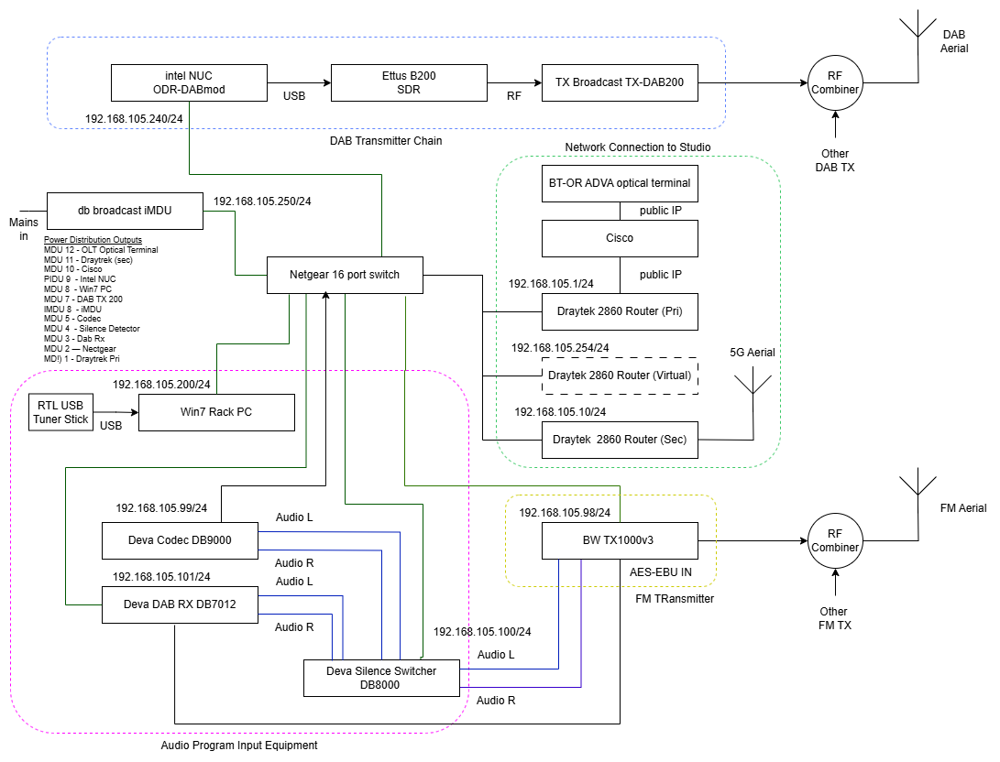

# Overview of Broadcast Radio Management with Kuwaiba and OpenNMS

[Main Menu](../README.md) | [Radio Management Case Study](./README.md)

## Introduction

The Office of Communications (OFCOM) has licensed a network of small community radio stations to operate across the UK as illustrated in map below.

[source OFCOM](https://www.ofcom.org.uk/siteassets/resources/documents/manage-your-licence/community-radio/community-map.pdf?v=331663)

Many of these small stations are operated independently by small local organisation but some larger companies operate collections of stations.
Community local radio typically operates on a very tight budget and in many cases the stations have expertise in studio equipment but not in radio frequency transmitters. 
This leads them to out-source the construction and maintenance of the radio broadcast transmitters to small independent engineering companies who specialise in provisioning low cost broadcast infrastructure provided by OEM broadcast equipment manufacturers.

The stations cannot afford to have any breaks in transmission as this can significantly affect market share, audience perception and advertising revenues. 
For this reason, most of the transmission chain is often duplicated so that in the event of a single equipment failure, the station can remain on air.

However it is also very important to be able to detect and react to faults before a problem escalates to a station outage.
Often service monitoring is done through fairly manual mechanisms including the stations listening to their own output, listeners reporting problems or simple emails being sent out by the faulty transmission equipment.
Clearly this is a bit disjointed and not entirely satisfactory. 
A cost effective monitoring system which can detect and escalate faults would be very desirable.

In this project we demonstrate how comprehensive monitoring solution could be constructed using OpenNMS and Grafana to monitor a variety of transmission stations and provide independent alerts and dashboards to each of the local radio contractors.

In addition we demonstrate how Kuwaiba could be used to store a network inventory which documents all of the equipment on multiple sites and the topology of relationships between this equipment and the transmission services.

We also show how the Kuwaiba model can be used to populate OpenNMS and provide an end to end design and provisioning solution for broadcast networks.

## A Typical Broadcast Site

The schematic below shows the design of a typical FM and DAB transmitter for a small radio station. 
The specific station and site have been anonymised.
The manufacturers of each broadcast function may change from station to station but the structure is fairly typical.

The power is distributed from the top of the rack using a managed distribution unit (iMDU).
This monitors power to all of the devices and allows remote turning on and off of each box. 

The station is connected to the studio through an optical network backed up by a 5G connection. 
Two Draytek routers are designated as Primary and Secondary connections and present a single virtual address to the subnet which is the same no matter which primary or the secondary router is currently being used.

The Audio program input equipment controls what happens if the studio input fails.
The silence switcher can choose between re-broadcasting a DAB or FM signal received from another station off air or if this fails, playing out a pre-recorded MP3 program or announcement.

An off the shelf FM transmitter broadcasts the audio signal along side an injected RDS signal.

The DAB Transmitter chain is more complicated because it uses a set of open source software defined radio components to create the DAB multiplex before amplification through an RF amplifier.

Most of the equipment supports SNMP although the broadcast MIBs are proprietary to each manufacturer and SNMP Traps are not always supported. 

Some of the equipment also supports SYSLOG events although these have proven not to provide very useful messages.

The DAB transmitter chain uses a set of separate components which do not provide a unified management interface but do provide programming API's which could be used for monitoring. 

An image of this equipment in a rack is shown below. 

## Requirements

We 

## Menu

[Kuwaiba OpenNMS Integration](./opennmsRadioModel.md)

[Grafana Radio Model](./grafanaRadioModel.md)

[Kuwaiba Radio Model](./kuwaibaRadioModel.md)

[Kuwaiba OpenNMS Integration](./opennmsKuwaibaIntegration.md)

