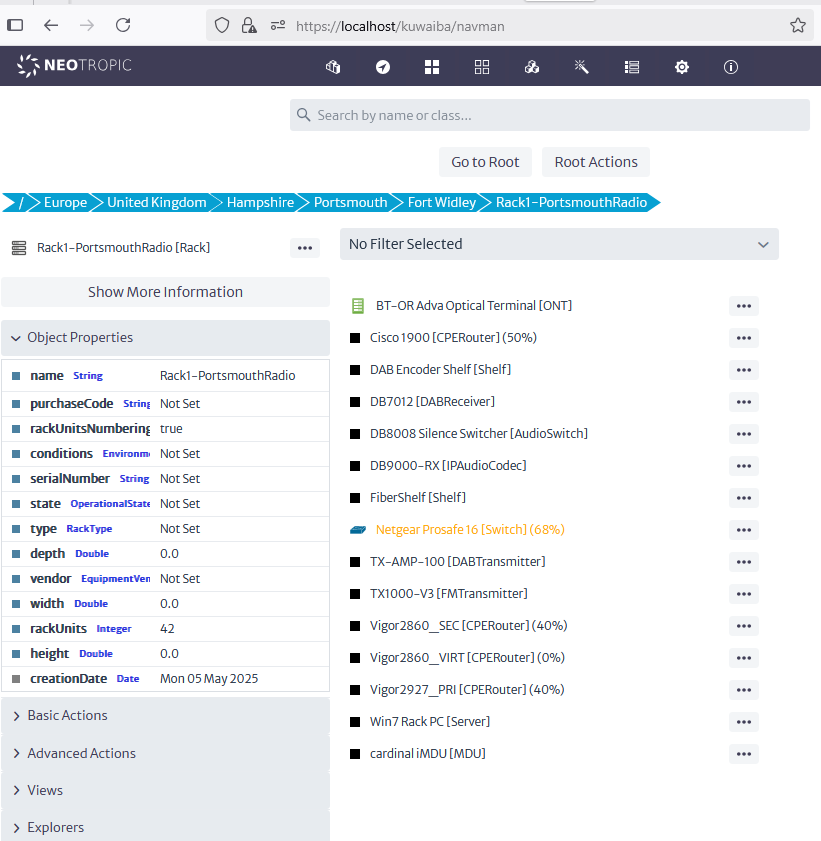
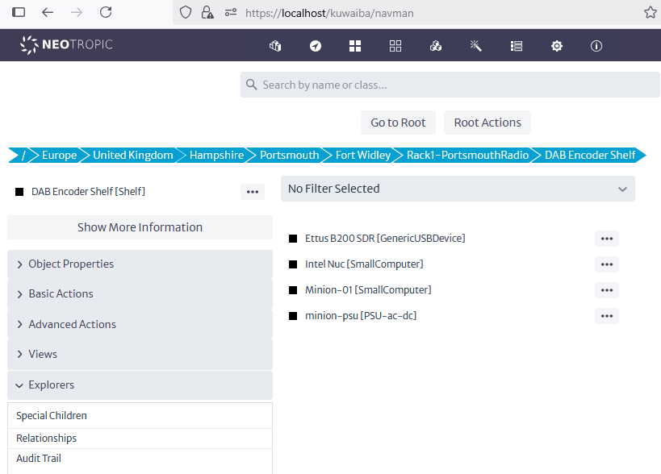
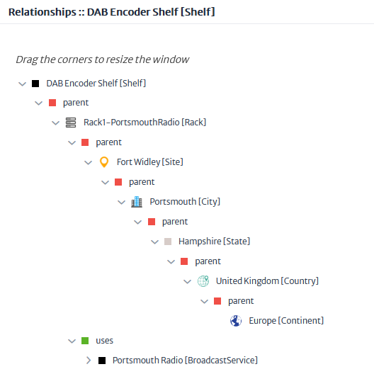
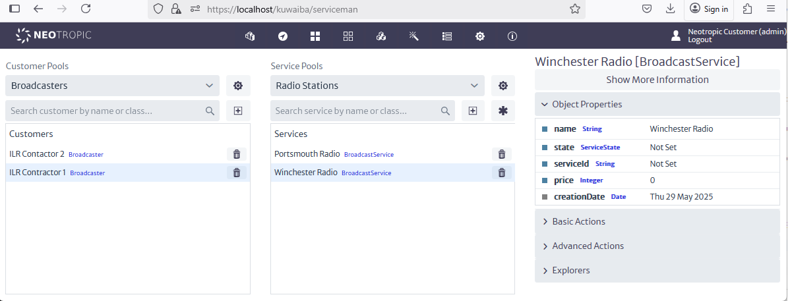
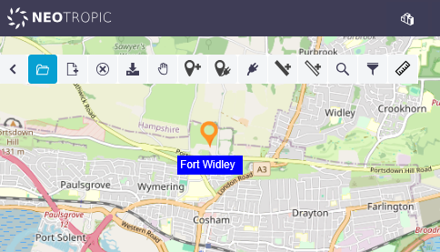
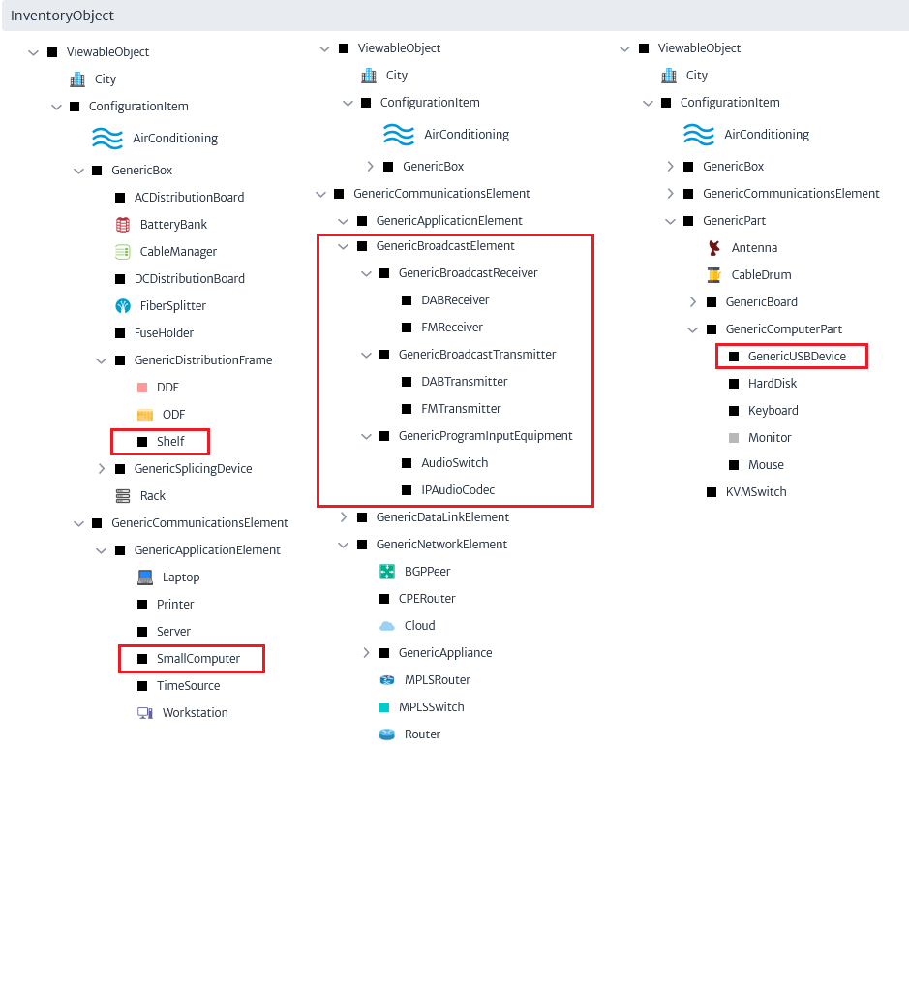

# Modelling a Radio Network in Kuwaiba

[Main Menu](../README.md) | [Radio Modelling](../docs/README.md) | [Kuwaiba Radio Model](../docs/kuwaibaRadioModel.md)

TBD













```
Class Name:
BroadcastService
Containment Path
: Radio Stations [Pool of GenericService]: ILR Contractor 1 [Broadcaster]: Broadcasters [Pool of GenericCustomer]
```






