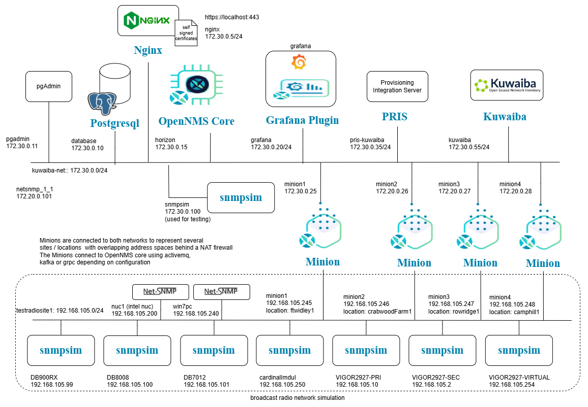
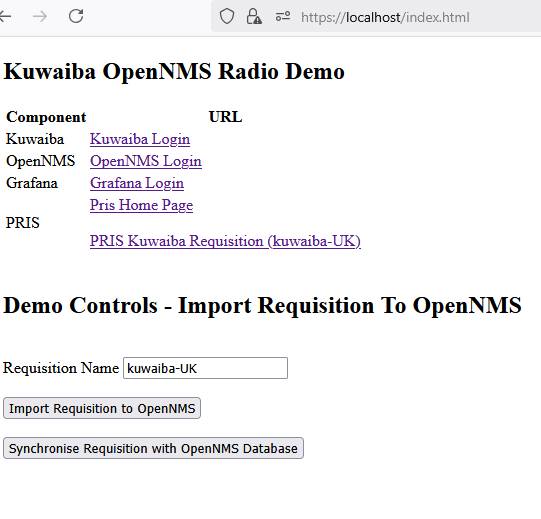

# Kuwaiba Broadcast Radio Demonstration and Test project

Note: This project is work in progress and subject to change.

This project contains a demonstration of modelling a network using Kuwaiba and exporting a network configuration from Kuwaiba to OpenNMS. 

* [Kuwaiba](https://www.kuwaiba.org/) is an open source Service Provider Inventory solution
* [OpenNMS](https://github.com/OpenNMS/opennms) is an open source enterprise grade network management platform.

The docker compose network model of the complete simulation is shown below.

The network devices are simulated using snmpsim containers and four minions scan these devices but represent them to OpenNMS as separate devices on four site locations.



## Brief Description
This docker compose project contains a Kuwaiba test project which uses the standard [kuwaiba 2.1.1 container](https://hub.docker.com/r/neotropic/kuwaiba).

The project demonstrates modelling a small broadcast radio network.
It also contains a report for exporting a configuration in a CSV format which can be directly imported to OpenNMS
using the [provisioning integration server PRIS](https://docs.opennms.com/pris/2.1.0/index.html).

The docker compose project extends the Kuwaiba container so that it can automatically import an external model from a data.zip file contained in this project.
This means that a full working Kuwaiba network model and report scripts can be included in the project for demonstration purposes.
Different projects can maintain separate models which makes it easy to create multiple demonstrators which are easy to run for testing and demonstration purposes.

The project also contains an OpenNNS installation and a simulated network using [snmpsim](https://github.com/etingof/snmpsim) to simulate the SNMP agents of the monitored devices.

Nginx is used to provide a front end and home page for the simulation including buttons to control the import of models from OpenNMS.

## Running only Nginx, Kuwaiba and opennms-pris

The full demo uses a lot of memory so there is an option to only run the Kuwaiba and opennms-pris containers.
With no profile set only Kuwaiba and kuwaiba-pris containers will start.

To run the project, wou should have Docker installed on your system.
([Docker Desktop](https://docs.docker.com/desktop/) on a PC).

Check out the project using git and cd to the `kuwaiba-docker-compose-radio` project.

Commands (in power shell or terminal window) when docker is running:

```
cd kuwaiba-docker-compose-radio

# build the extended kuwaiba container (only needed before first run - and may automaticlaly happen anyway)
docker compose build

# start kuwaiba as a service
docker compose up -d

# to see logs
docker compose logs -f kuwaiba

# to shut down
docker compose down
```
After a short time Kuwaiba will be available through the Nginx proxy at 

[https://localhost/kuwaiba](https://localhost/kuwaiba)

or directly at

[http://localhost:8080/kuwaiba](http://localhost:8080/kuwaiba)

The new Kuwaiba model will be imported from `container-fs/kuwaiba/data-zip/data.zip` on the first run.
(If data.zip is not present, the default kuwiba model from the container will be used).

Any changes to this model will be persisted to the docker `kuwaiba-data` volume across restarts.

You can clear the model back to the original data.zip by running

```
docker compose down -v
```
## default credentials

The following default credentials are used in this demo. 
(They may be changed in a publicly hosted version)

| Component         |URL                         | Username | Password |
| :---------------- | :------------------------- |:-------- | :------- |
| OpenNMS           | https://localhost/opennms  | admin     | admin   |
| Grafana           | https://localhost/grafana  | admin     | mypass  |
| Kuwaiba           | https://localhost/kuwaiba  | admin     | kuwaiba |

## Running the complete simulation

The docker compose script has a profile to start OpenNMS and the simulated devices as well as Kuwaiba and PRIS.

```
docker compose  --profile opennms up -d
```
With the [opennms] profile set all the containers will start (kuwaiba, pris and opennms, grafana, 4 minions and the simulated radio network).


Note the simulation will take a few minutes to start first time.

To follow progress use

```
docker compose  --profile opennms ps
```

When all of the containers are running and/or show `healthy`, the simulator is running.
Wait until all the minions become `healthy`


You can access the containers usign the nginx hosted front page at

[https://localhost/index.html](https://localhost/index.html)



This page gives links to all of the components behind the proxy and also buttons which make rest calls to load and synchronise requisitions into OpenNMS.

To ensure complete shutdown use

```
docker compose  --profile opennms down
```

You can look at OpenNMS logs using

```
docker compose --profile opennms logs -f opennms 
```

To clear the simulation including OpenNMS and Kuwaiba back to the initial state use

```
docker compose  --profile opennms down -v
```

## Creating a zip of your own kuwaiba model.

You can export/backup any changes to your own model as data.zip from a running container by zipping the /data folder in a running kuwaiba container.
The following commands will do this for a running project without logging into the container.

```
# creates a zip of the data inside the container
docker compose exec kuwaiba sh -c "rm -rf /tmp/kuwaiba && mkdir /tmp/kuwaiba && zip -rv  --exclude='/data/logs*' /tmp/kuwaiba/data.zip /data/* "

# copy the zip file out of the container to overwrite the current data.zip
docker compose cp kuwaiba:/tmp/kuwaiba/data.zip ./container-fs/kuwaiba/data-zip
```

## Model Contents
The Radio Network is modelled under country `United Kingdom`.

See the `OpenNMSInventoryExport` report under the `Reports` tab in `Inventory report`s. 

Running this report exports the model in CSV format for import to OpenNMS Pris.

## Pris

The provisioning integration server can use the kuwaiba rest api to get the pris CSV report directly from kuwaiba.

To generate a requisition file for all devices in the model with an IP address use

[https://localhost/requisitions/kuwaiba-all](https://localhost/requisitions/kuwaiba-all)

or

[http://localhost:8020/requisitions/kuwaiba-all](http://localhost:8020/requisitions/kuwaiba-all)

To generate a requisition file for only devices with an IP address in the UK use

 [https://localhost/requisitions/kuwaiba-UK](https://localhost/requisitions/kuwaiba-UK)
 
 or

 [http://localhost:8020/requisitions/kuwaiba-UK](http://localhost:8020/requisitions/kuwaiba-UK)

A test requisition which uses a local CSV file and runs without Kuwaiba running is also provided using 

[http://localhost:8020/requisitions/testrequisition](http://localhost:8020/requisitions/testrequisition)

or

[https://localhost/requisitions/testrequisition](https://localhost/requisitions/testrequisition)

### Importing Requisition from PRIS

An event can be sent to OpenNMS to request that it imports a requisition from an external URL.

See [OpenNMS import provisioning to OpenNMS](https://docs.opennms.com/pris/2.1.1/provision-to-opennms.html)

[The Provisioning Integration Server PRIS](https://docs.opennms.com/pris/2.1.1/index.html) is used as source of data to generate this requisition from external sources such as an excel spreadsheet or a csv file or using a groovy script.

In this case, a groovy script is called in Pris which makes a rest call to kuwaiba to run a report which returns csv data to pris for onward translation to an OpenNMs requisition

To tell OpenNMS to import from PRIS,  post the following event to the OpenNMS REST api (change address as necessary)

```
POST http://localhost:8980/opennms/rest/events

Content-Type Application/xml

Accept Application/xml

<event><uei>uei.opennms.org/internal/importer/reloadImport</uei>
     <parms><parm>
         <parmName>url</parmName><value>http://pris-kuwaiba:8000/requisitions/kuwaiba-UK</value>
     </parm></parms> 
</event>
```
The requisition should also be synchronised if this event is used to import it.
However it can also be synchronised with the opennms database using

```
PUT http://localhost:8980/opennms/rest/requisitions/kuwaiba-UK/import?rescanExisting=true
```

The Nginx hosted demo front page contains two buttons `Import Requisition to OpenNMS` and `Synchronise Requisition with OpenNMS Database` which can be used to send these request to OpenNMS.

(Note that on first startup you may need to retry these buttons because Kuwaiba may not respond to the first request if the application is not fully started)

[https://localhost/index.html](https://localhost/index.html)

## reloading using send event pl

Note this is included because it works on most linux distributions of OpenNMS but perl is not installed in latest OpenNMS containers so send-event.pl will not work in this demo.
```
docker compose exec horizon /usr/share/opennms/bin/send-event.pl uei.opennms.org/internal/importer/reloadImport -p 'url http://pris-kuwaiba:8000/requisitions/kuwaiba-UK' 
```
